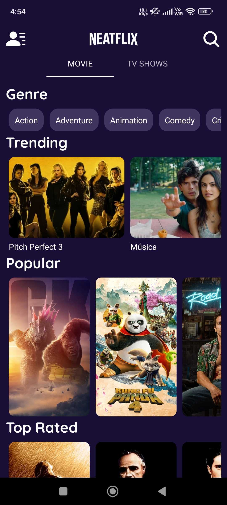
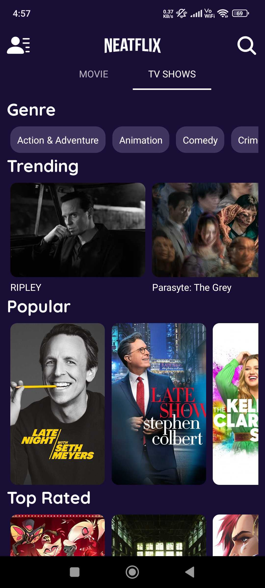

# NEATFLIX

App built using [React Native Expo](https://expo.dev/) that consumes [TMDB API](https://developers.themoviedb.org/3/getting-started/introduction) to display the current trending, upcoming, top rated, and popular movies and tv-shows. It also suggests films based on your watch list.

---
# Setup Requirements
### Prerequisites

Before you begin, make sure you have Node.js and npm installed on your machine. You can download and install them from [here](https://nodejs.org/).

Obtain your API key from [TMDB](https://developers.themoviedb.org/3/getting-started/introduction) and add it in a file named `.env` within the root directory:

```bash
NEATFLIX_API_KEY="****"
```

then run following command:

```bash
npm i
```

#### `npm start`

Runs the app in the development mode.

#### `npm run ios`

Like `npm start`, but also attempts to open your app in the iOS Simulator if you're on a Mac and have it installed.

#### `npm run android`

Like `npm start`, but also attempts to open your app on a connected Android device or emulator.

---

---
# Screenshots

  


---
# Learn More

You can learn more about Expo in the [Expo documentation](https://docs.expo.dev/).

To learn React Native, check out the [React Native documentation](https://reactnative.dev/).

## Additional Resources

- [Expo CLI](https://docs.expo.dev/workflow/expo-cli/)
- [Expo Go](https://expo.dev/client/)

Happy coding!
